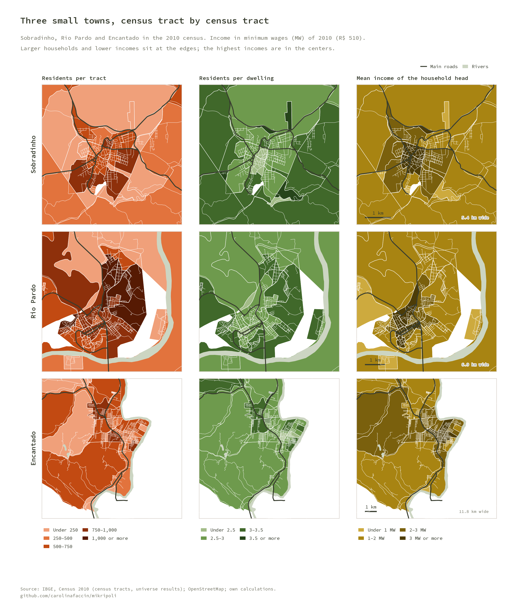
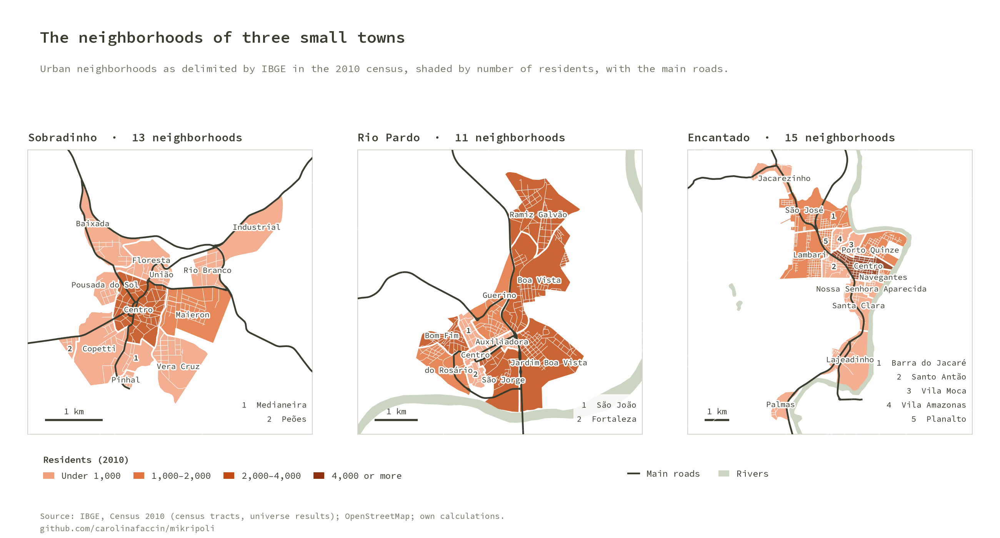
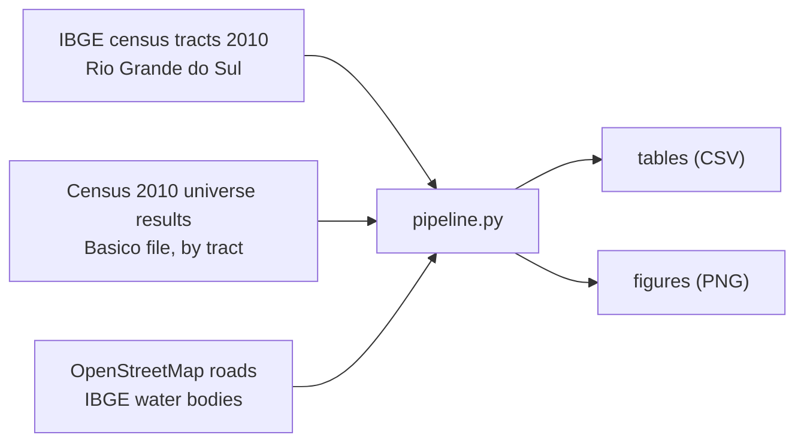

# MIKRIPOLI

**Three small cities of Rio Grande do Sul, Brazil, in the 2010 census.** A reproducible look at the population, household size, income and neighborhoods of Sobradinho, Rio Pardo and Encantado, the case-study towns of the comparative morphology study of the Mikripoli research network on small cities.

It rebuilds, in Python, the census maps of
[*Morfologia urbana, pequenas cidades e desenvolvimento regional na Região Intermediária de Santa Cruz do Sul e Lajeado-RS-Brasil*](https://online.unisc.br/seer/index.php/redes/article/view/19899)
(Silveira, Faccin, Detoni & Silva, 2024) from the IBGE census tracts of 2010.

## Key results

- **The center is where income is.** In all three towns the household heads of the central neighborhood earn the most: on average 3.7 minimum wages in Sobradinho, 4.8 in Rio Pardo and 3.8 in Encantado (2010), against 0.9 to 1.5 in the poorest neighborhoods.
- **Larger households at the edges.** Tracts with 3.5 or more residents per dwelling sit on the periphery and in the rural surroundings; the centers have the smallest households.
- **Different degrees of urbanization.** 87% of Encantado's residents lived in urban tracts in 2010, 79% in Sobradinho and 68% in Rio Pardo.
- **Small, but not simple.** The three seats have 11 to 15 neighborhoods each, with the center, the riverside and the highway accesses as their structuring elements.

## Figures





## How it works



1. **Tracts.** The 154 census tracts of the three municipalities, joined to the universe results: residents in permanent private dwellings (V002), mean residents per dwelling (V003) and mean monthly income of the household heads (V005), in minimum wages of 2010 (R$ 510).
2. **Neighborhoods.** The urban tracts of each municipal seat dissolved by their IBGE neighborhood code.
3. **Context.** Roads from OpenStreetMap (downloaded once and cached) and water bodies from IBGE.

## Run it

```bash
python -m venv venv && source venv/bin/activate
pip install -r requirements.txt
cp config/config.local.json.example config/config.local.json   # set raw_dir and data_dir
python pipeline.py                               # tables + figures + README images
pytest                                           # unit tests
```

`config/config.local.json` (gitignored) sets two folders:

| Key | Purpose |
|---|---|
| `raw_dir` | Shared raw-data catalog. Reads the 2010 tracts from `ibge/censo/2010/setores_censitarios_rs/t0/`, the universe results from `ibge/censo/2010/universo_rs/t0/CSV/Basico_RS.csv` and the water bodies from `_projetos/rio_pardo_enchentes_2024/shp/` |
| `data_dir` | This project's outputs: `tables/`, `figures/`, `cache/` |

## Outputs (`data_dir`)

| File | Content |
|---|---|
| `tables/tracts_2010.csv` | The 154 tracts with residents, residents per dwelling and income |
| `tables/towns_2010.csv` | Residents, urban share and mean income by town |
| `tables/neighborhoods_2010.csv` | Residents, residents per dwelling and income by neighborhood (means weighted by residents) |
| `tables/comparison_with_paper.csv` | Value ranges vs. the class limits of the published map |
| `figures/*.png` | All figures (copied to `docs/img/` for this README) |

## Check against the paper

The class limits printed on the published map match the data: residents per tract up to 1,229 and residents per dwelling from 2.0 to 4.5. The smallest tract has 2 residents; the map's first class starts at 3.

## Notes on the data

- **Census 2010.** The paper used the 2010 census, the latest with income by tract when it was written.
- **Residents** count people in permanent private dwellings, so they add up to slightly less than the total population.
- **Neighborhoods** are those coded by IBGE in 2010; municipal laws may delimit them differently today.

## Repository layout

```
pipeline.py            orchestrator (tables, figures, docs)
src/mikripoli/
  config.py            paths from config/config.local.json
  data.py              tracts, census results, neighborhoods, roads, water
  metrics.py           tables and the check against the paper
  osm.py               OpenStreetMap roads (Overpass API, cached)
  figures.py           figures
  style.py             figure style: source line and repository name
  brand.py             visual identity (colors, palettes, Source Code Pro, layout); copied
                       from the author's brand repository, do not edit here
tests/                 synthetic unit tests
assets/fonts/          Source Code Pro (SIL OFL)
```

## Credits

Paper: Silveira, R. L. L.; Faccin, C. R.; Detoni, L. P.; Silva, P. J. R. (2024). *Morfologia urbana, pequenas cidades e desenvolvimento regional na Região Intermediária de Santa Cruz do Sul e Lajeado-RS-Brasil.* Redes, 29. Part of the work of the Mikripoli research network on small cities.

Data: [IBGE](https://www.ibge.gov.br/) Census 2010 and [OpenStreetMap](https://www.openstreetmap.org/copyright) contributors (ODbL). Figures use the Source Code Pro typeface (SIL Open Font License).

## License

GNU General Public License v3.0, see [LICENSE](LICENSE).
